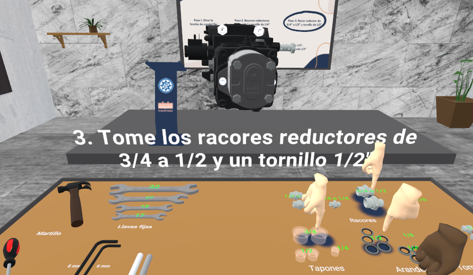

# Formación Laboral utilizando Realidad Virtual y Realidad Mixta en Carretillas Amate

## Descripción
Este proyecto presenta una **solución de formación laboral inmersiva** desarrollada utilizando tecnologías de Realidad Virtual y Realidad Mixta en la plataforma **ShapesXR**, usando el dispositivo **Meta Quest 3**.

**Autor:** Daniel Bervel Morales
**Fecha:** 1-09-2024  
**Formación:** Ingeniero electrónico industrial y automática | Máster en Industria 4.0

## Introducción
El futuro de la formación laboral es inmersivo, interactivo y dinámico. Durante mi máster en **Industria 4.0**, desarrollé una solución de formación que proporciona un entorno **seguro y práctico** para aprender tareas complejas. Este proyecto simula escenarios laborales donde los empleados pueden interactuar con herramientas y materiales tanto en entornos virtuales como reales, permitiendo una experiencia práctica sin los riesgos o costos de la formación en el mundo real.

La solución está compuesta por cuatro experiencias únicas:

1. **Listado de Herramientas**: Los usuarios pueden visualizar las herramientas necesarias para el montaje, mejorando la familiarización y reduciendo los tiempos de preparación.

2. **Listado de Materiales**: Información detallada sobre los materiales requeridos para la tarea, permitiendo que los trabajadores sepan qué necesitan antes de comenzar el proceso.

3. **Formación Paso a Paso en VR**: Una guía completamente inmersiva que guía a los usuarios a través del proceso de montaje en un **entorno virtual**, garantizando una experiencia de aprendizaje segura y controlada.

4. **Prueba Práctica de Montaje en Realidad Mixta**: Una combinación de montaje virtual y real, donde los usuarios interactúan simultáneamente con elementos físicos y digitales.

Esta solución de formación mejora la **eficiencia en el entrenamiento de los empleados**, reduce errores y acelera la curva de aprendizaje al combinar simulaciones virtuales con la práctica real.

